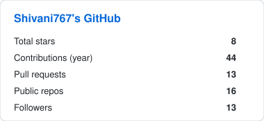
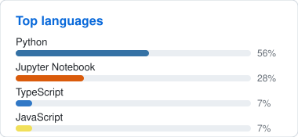

# Shivani Bhandari

I build **agentic systems** with a real backend: tools, memory, checkpoints, and eval — not chat wrappers. Also inference measurement (ONNX, quantization) when the loop needs a smaller model.

[Resume](./Shivani_Bhandari_Resume.pdf)
· [LinkedIn](https://www.linkedin.com/in/shivani-bhandari-bbb69a333/)
· [Microsoft Learn](https://learn.microsoft.com/en-in/users/shivani-9485/)
· [LeetCode](https://leetcode.com/u/shivani767/)
· [Codeforces](https://codeforces.com/profile/Shivani_103)
· [Kaggle](https://www.kaggle.com/shivanibhandari767)
· [Email](mailto:Shivani215143@gmail.com)

  
  
  
  

## GitHub

  
  

**Achievements:** [Pull Shark](https://github.com/Shivani767?achievement=pull-shark&tab=achievements) · [YOLO](https://github.com/Shivani767?achievement=yolo&tab=achievements) · [Quickdraw](https://github.com/Shivani767?achievement=quickdraw&tab=achievements)

  
  
  

## Stack

Agent runtime + serving path I actually use:

  

| Area | Tools |
|---|---|
| **Agents** | LangGraph, AutoGen, tool calling, checkpoints, RAG + FAISS |
| **Backend** | FastAPI, PostgreSQL, Redis, Docker, GitHub Actions |
| **Inference** | ONNX Runtime, vLLM, llama.cpp, GPTQ / AWQ (when measuring, not as the product) |

## Work

| | |
|---|---|
| [IndicQuant](https://github.com/Shivani767/IndicQuant) | Document pipeline + AutoOpt **mer → compile → solve**. Golden-set eval on CPU. [Kaggle](https://www.kaggle.com/code/shivanibhandari767/indicquant-mer-compile-solve-on-cpu) |
| [LangGraph](https://github.com/Shivani767/langgraph) | Pregel / DeltaChannel persistence, checkpoint rebuild, HITL |
| [AutoGen](https://github.com/Shivani767/autogen) | Multi-agent plan → tools → memory |
| [InferLite](https://github.com/Shivani767/llm-inferlite) | Runtime + quantization bench (TTFT, tok/s, memory) |
| [ONNX Runtime](https://github.com/Shivani767/onnxruntime) | WebGPU 2-bit quantization path |

## Competitive programming

[LeetCode](https://leetcode.com/u/shivani767/) **1708** · 525 solved &nbsp;·&nbsp; [Codeforces](https://codeforces.com/profile/Shivani_103) `Shivani_103`

## Education

B.E. ECE, UIET, Panjab University (2021–2025) · CGPA 8.09/10  
[Microsoft Learn](https://learn.microsoft.com/en-in/users/shivani-9485/) · Responsible Generative AI · GSSoC
